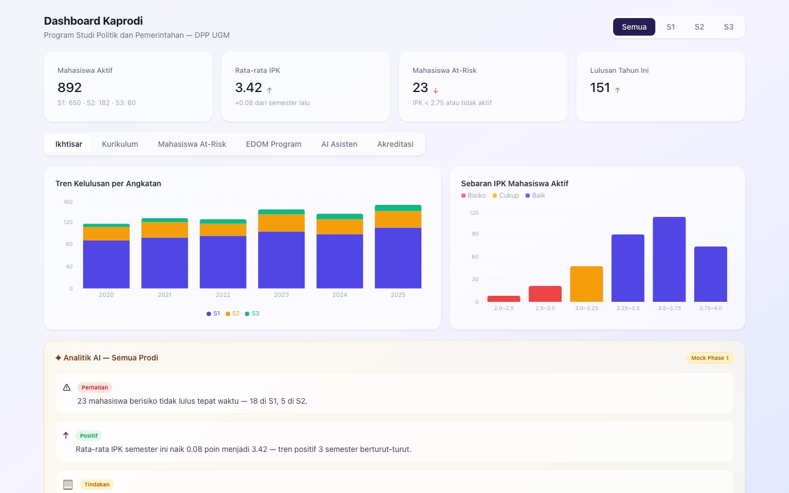
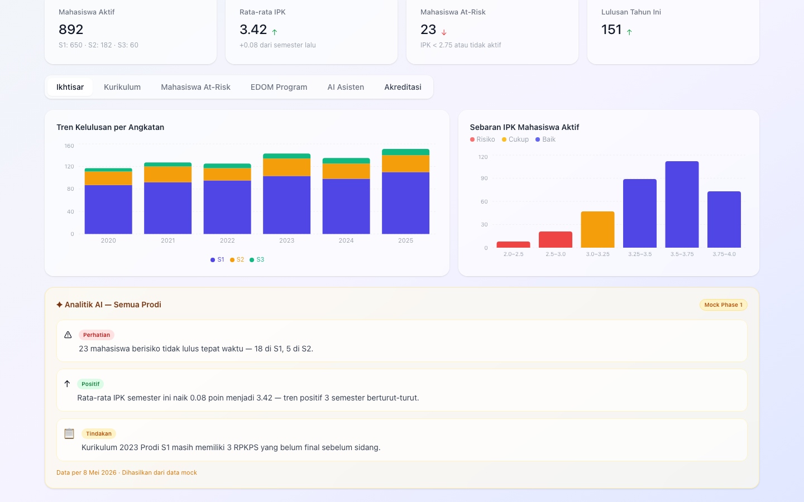
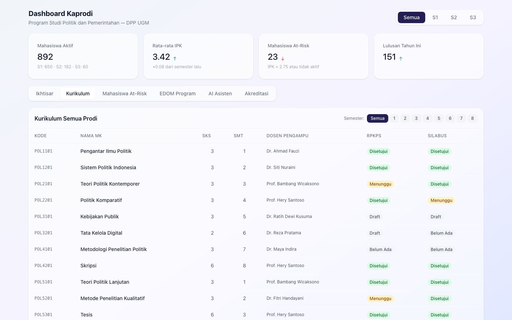
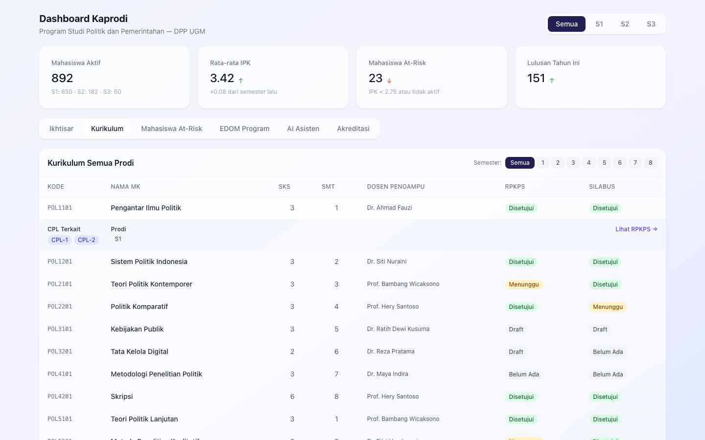
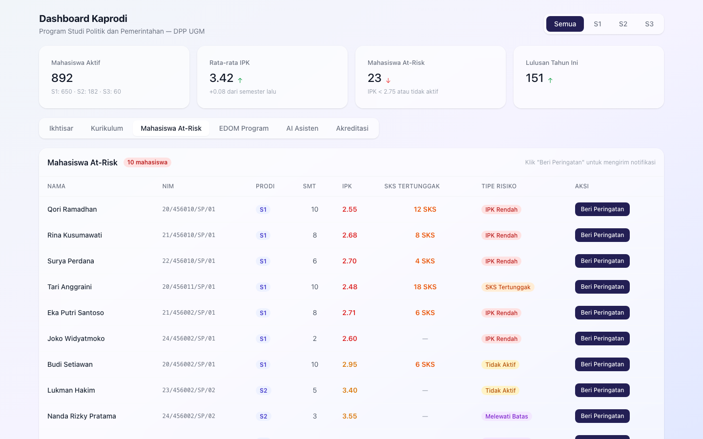
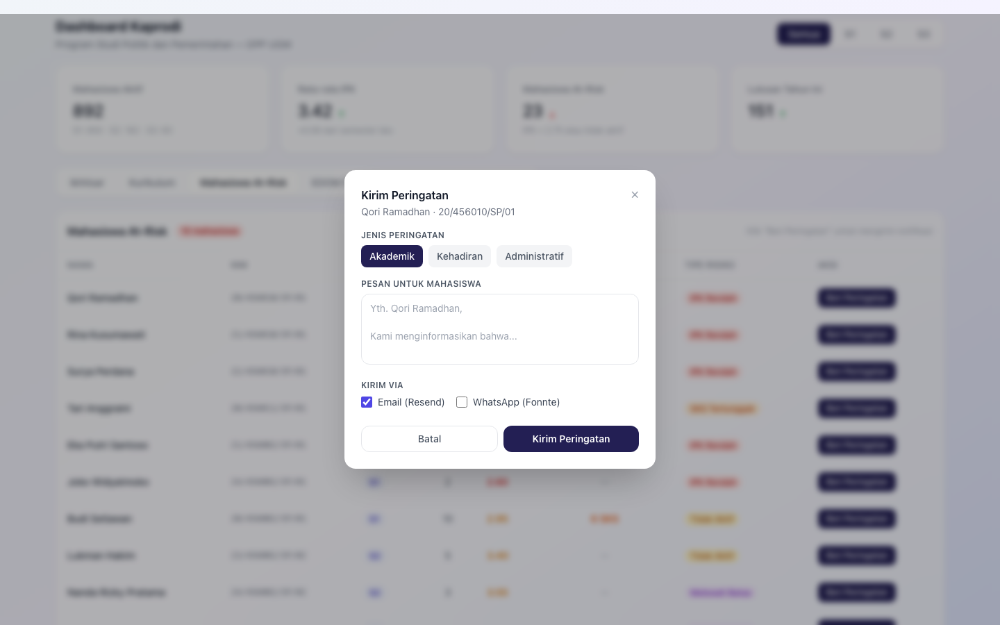
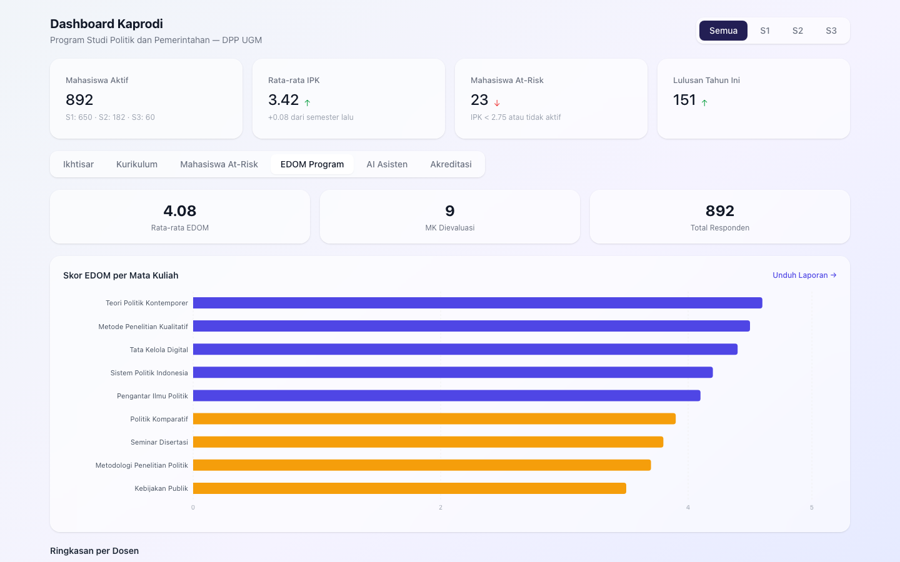
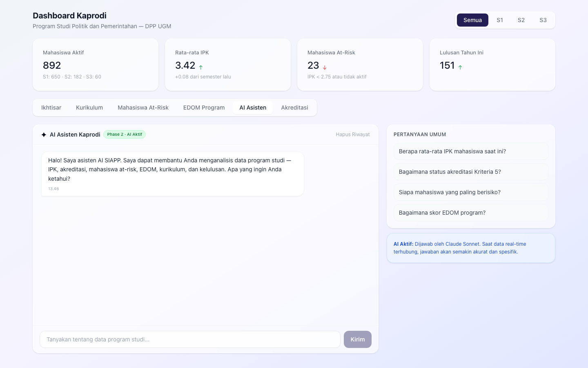
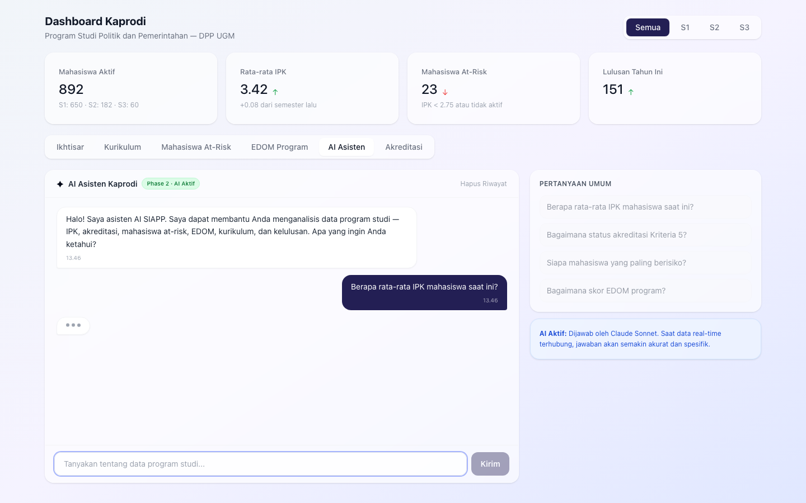
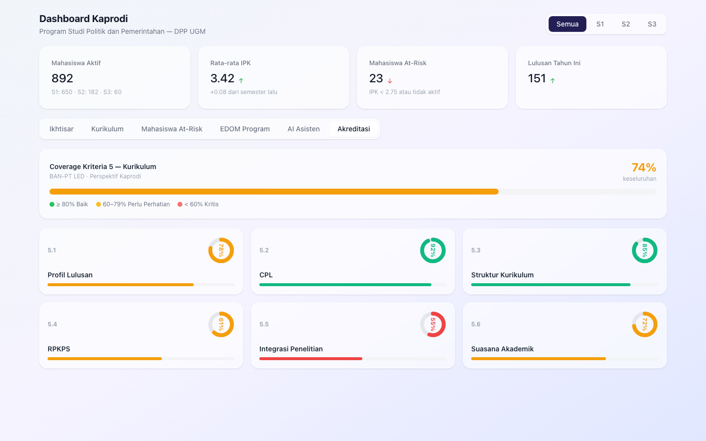

# Panduan Pengguna SIAPP
## Ketua Program Studi (Kaprodi)
**Sistem Informasi Departemen Politik Pemerintahan — UGM**

---

> Dokumen ini ditujukan khusus untuk **Ketua Program Studi (Kaprodi)** — baik S1, S2, maupun S3. Panduan ini ditulis dalam bahasa yang mudah dipahami tanpa perlu pengetahuan teknis.

---

## Daftar Isi

1. [Masuk ke Sistem](#1-masuk-ke-sistem)
2. [Halaman Utama (Dashboard)](#2-halaman-utama-dashboard)
3. [Tab Ikhtisar — Ringkasan Program](#3-tab-ikhtisar--ringkasan-program)
4. [Tab Kurikulum](#4-tab-kurikulum)
5. [Tab Mahasiswa At-Risk](#5-tab-mahasiswa-at-risk)
6. [Tab EDOM Program](#6-tab-edom-program)
7. [Tab AI Asisten](#7-tab-ai-asisten)
8. [Tab Akreditasi](#8-tab-akreditasi)
9. [Keluar dari Sistem](#9-keluar-dari-sistem)

---

## 1. Masuk ke Sistem

1. Buka browser (Chrome atau Firefox dianjurkan) dan masuk ke alamat SIAPP yang diberikan.
2. Pada halaman login, masukkan **alamat email UGM** Anda (contoh: `namakaprodi@ugm.ac.id`).

3. Klik tombol **Kirim Kode OTP**.
4. Buka email Anda — Anda akan menerima kode 6 angka dalam beberapa detik.
5. Masukkan kode tersebut pada halaman verifikasi, lalu klik **Verifikasi**.

6. Sistem akan otomatis membawa Anda ke **Dashboard Kaprodi**.

> **Catatan:** Kode OTP hanya berlaku selama 10 menit. Jika kode kedaluwarsa, klik "Kirim ulang kode".

---

## 2. Halaman Utama (Dashboard)

### 2.1 Pemilih Program Studi

Di bagian atas halaman terdapat tombol pemilih program:

- **Semua** — menampilkan data gabungan S1 + S2 + S3
- **S1** — hanya data Program Studi S1
- **S2** — hanya data Program Studi S2
- **S3** — hanya data Program Studi S3

Klik program yang ingin Anda pantau. Seluruh data di bawahnya akan berubah mengikuti pilihan ini.

### 2.2 Kartu KPI (Indikator Kunci)

Empat kartu menampilkan kondisi program studi saat ini:

| Kartu | Keterangan |
|---|---|
| **Mahasiswa Aktif** | Jumlah mahasiswa yang sedang aktif kuliah |
| **Rata-rata IPK** | Nilai IPK rata-rata seluruh mahasiswa, dibandingkan semester lalu |
| **Mahasiswa At-Risk** | Jumlah mahasiswa dengan IPK di bawah 2,75 atau tidak aktif |
| **Lulusan Tahun Ini** | Jumlah mahasiswa yang sudah lulus tahun ini |

Panah naik (↑) berarti kondisi membaik; panah turun (↓) berarti perlu perhatian.

### 2.3 Tab Navigasi

Di bawah kartu KPI, terdapat 6 tab untuk mengakses fitur-fitur utama:
**Ikhtisar · Kurikulum · Mahasiswa At-Risk · EDOM Program · AI Asisten · Akreditasi**

---

## 3. Tab Ikhtisar — Ringkasan Program

Klik tab **Ikhtisar** untuk melihat grafik dan analisis program studi.

### 3.1 Grafik Tren Kelulusan

Grafik garis atau batang yang menunjukkan jumlah lulusan per tahun. Gunakan grafik ini untuk melihat apakah jumlah lulusan cenderung naik, stabil, atau turun.

### 3.2 Grafik Distribusi IPK

Grafik batang yang mengelompokkan mahasiswa berdasarkan rentang IPK:
- Di bawah 2,75 (merah — perlu intervensi)
- 2,75 – 3,0
- 3,0 – 3,5
- Di atas 3,5 (biru — berprestasi)

### 3.3 Wawasan AI

Panel yang menampilkan analisis otomatis dari sistem tentang kondisi program studi Anda. Setiap wawasan diberi label tingkat urgensi:
- **Tinggi** (merah) — perlu tindakan segera
- **Sedang** (kuning) — perlu dipantau
- **Info** (biru) — informasi umum

---

## 4. Tab Kurikulum

Klik tab **Kurikulum** untuk memantau seluruh mata kuliah dalam kurikulum program studi.

### 4.1 Menyaring per Semester

Klik tombol semester di bagian atas tabel untuk menampilkan mata kuliah di semester tertentu (1–8), atau klik **Semua** untuk melihat seluruh mata kuliah.

### 4.2 Tabel Kurikulum

Tabel menampilkan setiap mata kuliah dengan informasi:
- Kode mata kuliah
- Nama mata kuliah
- SKS (jumlah kredit)
- Semester
- Nama dosen pengampu
- Status **RPKPS** (Rencana Pembelajaran):
  - **Disetujui** (hijau) — dokumen sudah final
  - **Menunggu** (kuning) — dokumen sedang diproses
  - **Draft** (abu-abu) — dosen masih menyusun
  - **Belum Ada** — belum ada dokumen sama sekali
- Status **Silabus** (dengan warna yang sama)

### 4.3 Melihat Detail Mata Kuliah

Klik baris mata kuliah untuk memperluas detailnya, yang menampilkan:
- Capaian Pembelajaran Lulusan (CPL) yang terkait
- Program studi yang menjalankan mata kuliah ini
- Tautan **Lihat RPKPS →** untuk membuka dokumen rencana pembelajaran

---

## 5. Tab Mahasiswa At-Risk

Klik tab **Mahasiswa At-Risk** untuk melihat dan menangani mahasiswa yang memerlukan perhatian khusus.

### 5.1 Tabel Mahasiswa At-Risk

Tabel menampilkan mahasiswa yang teridentifikasi berisiko, dengan informasi:
- Nama mahasiswa
- NIM
- Program studi (S1/S2/S3)
- Semester saat ini
- IPK (merah jika < 2,75; kuning jika 2,75–3,0)
- SKS Tertunggak (jumlah SKS yang gagal/belum lulus)
- Tipe risiko:
  - **IPK Rendah** (merah)
  - **SKS Tertunggak** (oranye)
  - **Tidak Aktif** (kuning)
  - **Melewati Batas Studi** (ungu)

### 5.2 Mengirim Peringatan kepada Mahasiswa

1. Pada baris mahasiswa yang ingin diberi peringatan, klik tombol **Beri Peringatan**.
2. Pada formulir yang muncul, isi:
   - **Jenis Peringatan:** pilih Akademik, Kehadiran, atau Administratif.
   - **Pesan untuk Mahasiswa:** sistem sudah menyediakan template — Anda dapat mengubahnya sesuai kebutuhan.
   - **Kirim via:** centang saluran pengiriman yang diinginkan:
     - **Email** — dikirim ke email kampus mahasiswa
     - **WhatsApp** — dikirim ke nomor WhatsApp mahasiswa
3. Klik **Kirim Peringatan**.
4. Tombol akan berubah menjadi **✓ Terkirim** sebagai konfirmasi.

> **Catatan:** Peringatan yang sudah terkirim tidak dapat dibatalkan. Pastikan pesan sudah tepat sebelum mengirim.

---

## 6. Tab EDOM Program

Klik tab **EDOM Program** untuk melihat hasil **Evaluasi Dosen Oleh Mahasiswa** di tingkat program studi.

Halaman ini menampilkan skor evaluasi per mata kuliah dan per dosen, membantu Anda memantau kualitas pengajaran secara keseluruhan dalam program studi.

Skor yang rendah (ditandai dengan warna merah atau kuning) menunjukkan mata kuliah atau dosen yang mungkin perlu mendapat pendampingan atau evaluasi lebih lanjut.

---

## 7. Tab AI Asisten

Klik tab **AI Asisten** untuk berdiskusi langsung dengan asisten kecerdasan buatan yang memahami data program studi Anda.

### 7.1 Tampilan Antarmuka

- **Kolom kiri (2/3 layar):** jendela percakapan
- **Kolom kanan (1/3 layar):** pertanyaan umum siap pakai

### 7.2 Cara Menggunakan AI Asisten

1. Ketik pertanyaan Anda di kotak teks di bagian bawah jendela percakapan.
2. Tekan **Enter** atau klik tombol kirim (ikon panah).
3. Tunggu beberapa detik — AI akan menjawab pertanyaan Anda berdasarkan data program studi.

**Pertanyaan yang bisa Anda ajukan (contoh):**
- "Berapa rata-rata IPK mahasiswa saat ini?"
- "Bagaimana status akreditasi Kriteria 5?"
- "Siapa mahasiswa yang paling berisiko?"
- "Bagaimana skor EDOM program?"

Atau klik salah satu **Pertanyaan Umum** di kolom kanan untuk langsung mengirim pertanyaan tersebut.

### 7.3 Menghapus Riwayat Percakapan

Klik tombol **Hapus Riwayat** di pojok kanan atas jendela percakapan untuk mengosongkan riwayat chat dan memulai sesi baru.

> **Catatan:** AI Asisten menjawab berdasarkan data yang tersimpan di sistem. Untuk pertanyaan yang memerlukan data real-time dari luar sistem (misalnya Scopus atau SIMASTER), jawabannya mungkin tidak tersedia.

---

## 8. Tab Akreditasi

Klik tab **Akreditasi** untuk memantau status akreditasi program studi yang Anda pimpin.

### 8.1 Kartu Ringkasan Akreditasi

Kartu-kartu di bagian atas menampilkan:
- Skor rata-rata akreditasi program studi
- Jumlah kriteria yang sudah baik (≥ 80%)
- Jumlah kriteria yang perlu perhatian
- Jumlah kriteria yang masih kritis

### 8.2 Detail per Kriteria

Setiap kriteria akreditasi (K1–K9) ditampilkan dengan skor dan status saat ini. Klik salah satu kriteria untuk melihat indikator-indikator spesifik dan bukti yang sudah tersedia.

Gunakan tampilan ini sebagai dasar diskusi dengan dosen dan tim akreditasi untuk menentukan langkah perbaikan.

---

## 9. Keluar dari Sistem

1. Klik nama atau foto profil Anda di pojok kanan atas layar.
2. Klik **Keluar** (Logout).
3. Anda akan diarahkan kembali ke halaman login.

> **Tips keamanan:** Selalu keluar dari sistem setelah selesai menggunakannya, terutama jika menggunakan komputer bersama.

---

*Versi dokumen: 1.0 — Mei 2026*
*Untuk pertanyaan teknis, hubungi tim Pijar Foundation.*
