# Panduan Pengguna SIAPP
## Sekretariat / Admin TU
**Sistem Informasi Departemen Politik Pemerintahan — UGM**

---

> Dokumen ini ditujukan khusus untuk **Staf Sekretariat dan Admin Tata Usaha**. Panduan ini ditulis dalam bahasa yang mudah dipahami tanpa perlu pengetahuan teknis.

---

## Daftar Isi

1. [Masuk ke Sistem](#1-masuk-ke-sistem)
2. [Halaman Utama (Dashboard)](#2-halaman-utama-dashboard)
3. [Modul Persuratan](#3-modul-persuratan)
4. [Modul Booking Ruang](#4-modul-booking-ruang)
5. [Modul Kalender](#5-modul-kalender)
6. [Modul Notulensi](#6-modul-notulensi)
7. [Modul Renja (Rencana Kerja)](#7-modul-renja-rencana-kerja)
8. [Modul Renstra (Rencana Strategis)](#8-modul-renstra-rencana-strategis)
9. [Modul SOP](#9-modul-sop)
10. [Keluar dari Sistem](#10-keluar-dari-sistem)

---

## 1. Masuk ke Sistem

1. Buka browser (Chrome atau Firefox dianjurkan) dan masuk ke alamat SIAPP yang diberikan.
2. Pada halaman login, masukkan **alamat email UGM** Anda (contoh: `namastaff@ugm.ac.id`).

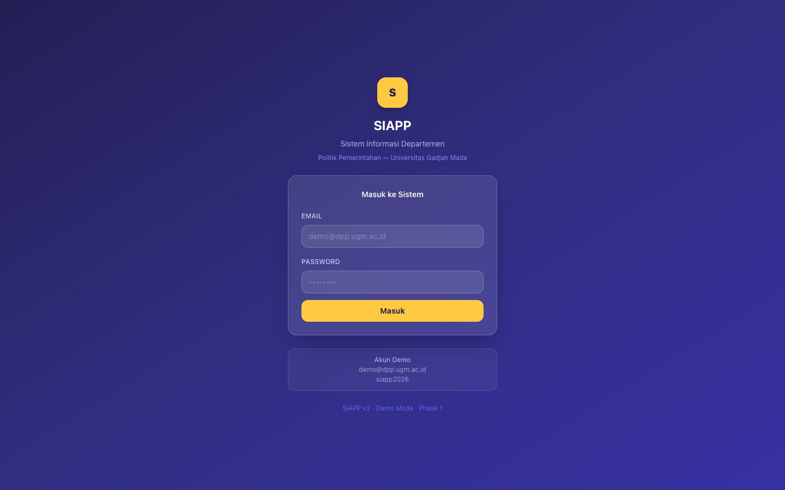

3. Klik tombol **Kirim Kode OTP**.
4. Buka email Anda — Anda akan menerima kode 6 angka dalam beberapa detik.
5. Masukkan kode tersebut pada halaman verifikasi, lalu klik **Verifikasi**.

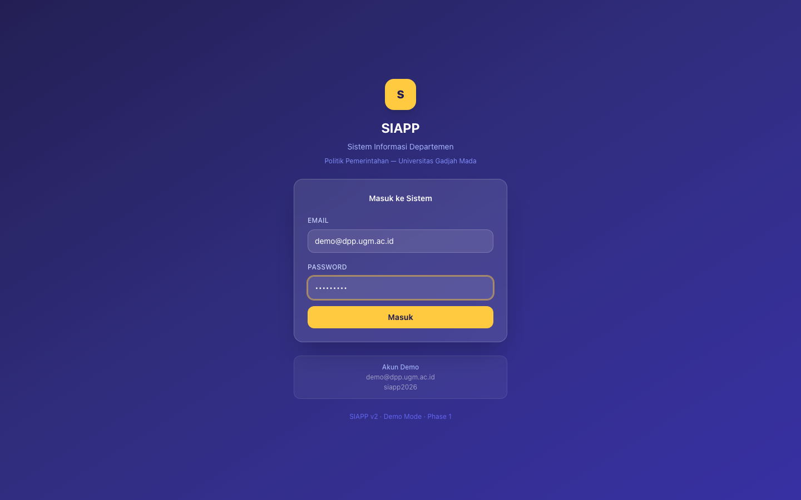

6. Sistem akan otomatis membawa Anda ke **Dashboard Sekretariat**.

> **Catatan:** Kode OTP hanya berlaku selama 10 menit. Jika kode kedaluwarsa, klik "Kirim ulang kode".

---

## 2. Halaman Utama (Dashboard)

Setelah masuk, Anda akan melihat halaman utama yang merangkum seluruh aktivitas operasional sekretariat.

### 2.1 Kartu Ringkasan Harian

Enam kartu di bagian atas menampilkan informasi penting hari ini:

| Kartu | Keterangan |
|---|---|
| **Surat Keluar Bulan Ini** | Jumlah surat keluar yang sudah dibuat bulan ini |
| **Booking Menunggu** | Jumlah peminjaman ruang yang belum dikonfirmasi |
| **Surat Masuk Belum Ditindaklanjuti** | Surat masuk yang belum ada responnya |
| **Workflow Tertahan** | Surat yang sudah >7 hari tanpa tanda tangan |
| **Realisasi Anggaran** | Persentase serapan anggaran hingga hari ini |
| **Kegiatan Bulan Ini** | Jumlah kegiatan yang terjadwal bulan ini |

### 2.2 Notifikasi Penting (Banner Merah)

Jika ada masalah yang perlu segera ditangani (misalnya surat yang tertahan terlalu lama atau anggaran kurang terserap), sistem akan menampilkan notifikasi berwarna merah di bagian atas. Klik notifikasi untuk langsung menuju data terkait.

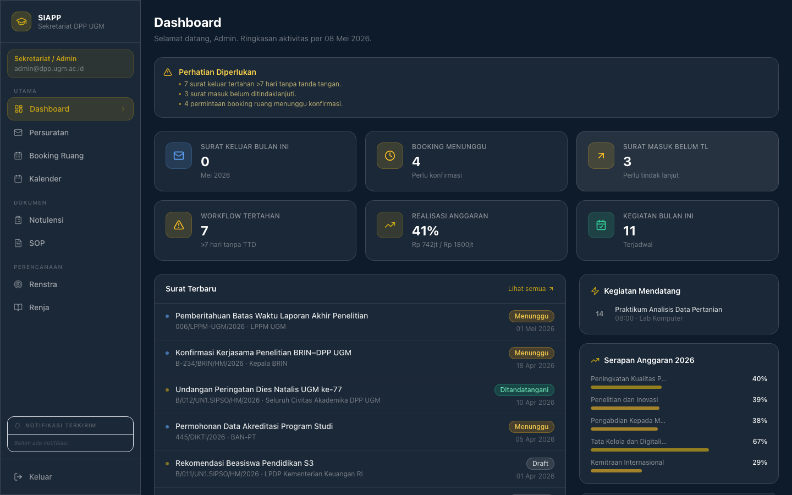

### 2.3 Panel Surat Terbaru

Menampilkan 6 surat terakhir yang masuk atau keluar. Ikon panah menunjukkan arah surat:
- **Panah keluar (emas)** — surat keluar
- **Panah masuk (biru)** — surat masuk

Klik **Lihat Semua** untuk membuka daftar lengkap di modul Persuratan.

### 2.4 Panel Kegiatan Mendatang

Menampilkan kegiatan yang akan berlangsung dalam 7 hari ke depan, lengkap dengan tanggal, waktu, lokasi, dan penyelenggara.

### 2.5 Serapan Anggaran

Bilah kemajuan per program menunjukkan seberapa besar anggaran yang sudah terserap dibanding total yang direncanakan.

### 2.6 Ringkasan Booking Ruang

Menampilkan jumlah booking ruang yang **dikonfirmasi**, **menunggu**, dan **ditolak** dalam bentuk angka dan bilah.

---

## 3. Modul Persuratan

Untuk membuka modul ini, klik **Persuratan** pada menu samping kiri.

### 3.1 Memahami Tampilan Tabel Surat

Tabel menampilkan seluruh surat dengan kolom berikut:
- Arah surat (ikon panah: keluar atau masuk)
- Nomor surat
- Perihal (subjek surat)
- Kategori surat (Undangan, Keputusan, Tugas, dll.)
- Kepada / Dari
- Tanggal
- Status (warna menunjukkan kondisi)

**Arti warna status:**
- **Abu-abu** — Draft (belum dikirim)
- **Kuning** — Menunggu persetujuan
- **Hijau** — Ditandatangani / selesai
- **Biru** — Diarsipkan

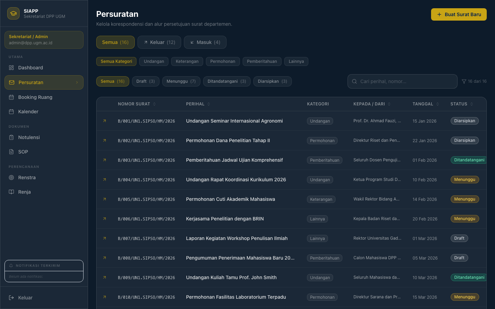

### 3.2 Menyaring dan Mencari Surat

**Menyaring berdasarkan arah:**
Klik tab **Semua**, **Keluar**, atau **Masuk** di bagian atas tabel.

**Menyaring berdasarkan kategori:**
Klik salah satu tombol kategori (Undangan, Keputusan, Tugas, Keterangan, Permohonan, Pemberitahuan, Lainnya).

**Menyaring berdasarkan status:**
Pilih status dari tombol filter (Semua / Draft / Menunggu / Ditandatangani / Diarsipkan).

**Mencari surat:**
Ketik kata kunci di kotak pencarian (bisa berupa perihal, nomor surat, nama tujuan, atau nama pengirim). Hasil pencarian akan muncul secara otomatis.

### 3.3 Membuat Surat Baru

1. Klik tombol **+ Buat Surat Baru** di pojok kanan atas.
2. Isi formulir yang muncul:
   - **Nomor Surat** — klik "Generate Otomatis" atau isi manual
   - **Perihal** — judul/subjek surat
   - **Tujuan** — nama penerima atau instansi
   - **Isi** — isi/tubuh surat
   - **Kategori** — pilih jenis surat yang sesuai
   - **Status Awal** — pilih Draft (belum siap dikirim) atau Menunggu (siap untuk disetujui)
3. Klik **Simpan**.

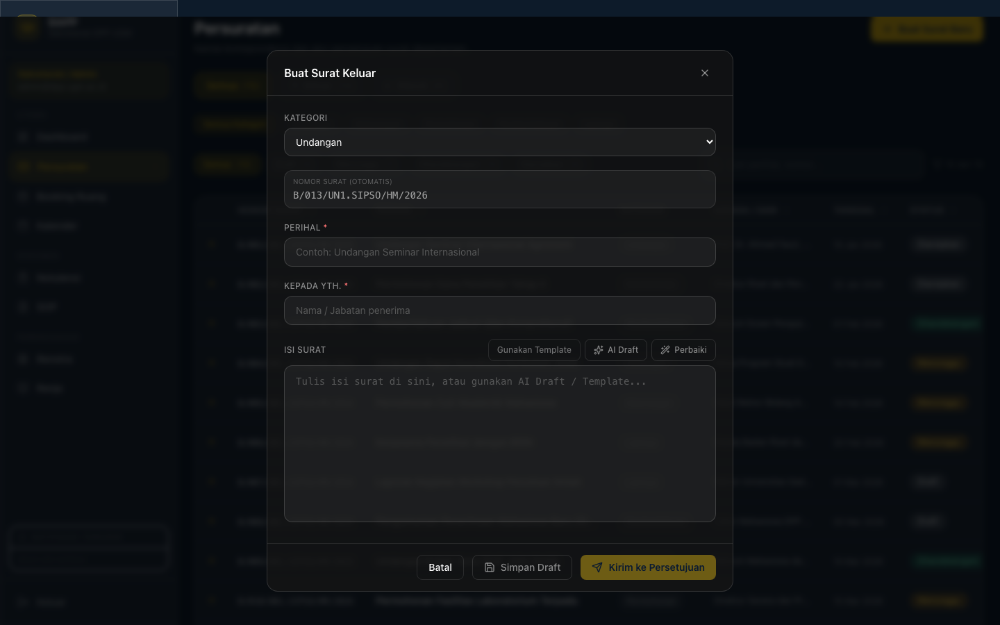

Surat yang berstatus **Menunggu** akan masuk ke antrean persetujuan Kadep secara otomatis.

### 3.4 Melihat Detail dan Riwayat Surat

1. Pada tabel, klik ikon **mata** atau tombol **Lihat Detail** di baris surat yang diinginkan.
2. Modal detail akan terbuka, menampilkan:
   - Seluruh informasi surat
   - **Alur Persetujuan** — tahap mana surat sudah disetujui (Dosen → Koordinator Riset → Kaprodi → Kadep)
   - **Riwayat** — siapa melakukan apa dan kapan

> 📸 *[Screenshot belum tersedia: Modal detail surat — bagian alur persetujuan 4 tahap dengan indikator tahap yang sudah selesai (centang) dan yang sedang berjalan]*

---

## 4. Modul Booking Ruang

Untuk membuka modul ini, klik **Booking Ruang** pada menu samping kiri.

### 4.1 Tampilan Utama

Halaman booking ruang terdiri dari dua bagian utama:

- **Kiri:** Kalender mini untuk memilih tanggal
- **Kanan:** Denah lantai interaktif yang menampilkan kondisi ruangan

**Arti warna ruangan pada denah:**
- **Hijau** — ruangan tersedia
- **Merah** — ruangan sudah dibooking
- **Abu-abu** — ruangan tidak tersedia (sedang dalam perbaikan, dll.)

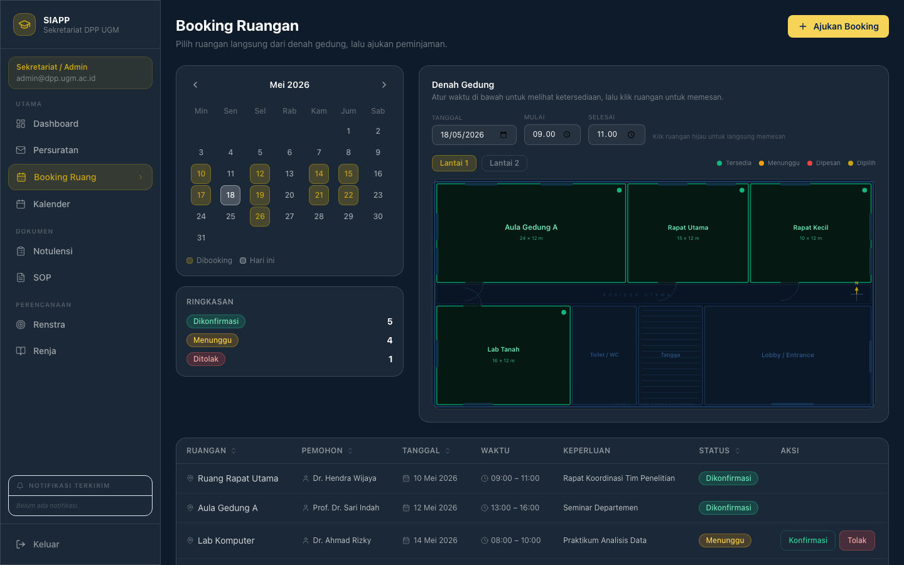

### 4.2 Membuat Booking Ruangan

**Cara 1 — melalui denah:**
1. Pilih tanggal pada kalender mini di sebelah kiri.
2. Atur jam mulai dan selesai menggunakan kontrol waktu di bawah denah.
3. Klik ruangan yang berwarna **hijau** pada denah — formulir akan terbuka dengan data ruangan sudah terisi.
4. Lengkapi sisa formulir: Nama Pemohon, Keperluan.
5. Klik **Kirim Permohonan**.

**Cara 2 — melalui tombol:**
1. Klik tombol **+ Buat Booking** di bagian atas.
2. Isi seluruh formulir: Ruangan, Nama Pemohon, Tanggal, Jam Mulai, Jam Selesai, Keperluan.
3. Klik **Kirim Permohonan**.

> 📸 *[Screenshot belum tersedia: Modal formulir booking — dropdown ruangan, nama pemohon, date picker, jam mulai/selesai, kolom keperluan, dan tombol "Kirim Permohonan"]*

> **Catatan:** Jika waktu yang dipilih **tidak ada konflik**, booking langsung dikonfirmasi otomatis. Jika ada jadwal yang bertabrakan, status akan menjadi **Menunggu** dan perlu dikonfirmasi manual oleh Anda.

### 4.3 Mengelola Booking yang Masuk

Pada tabel di bagian bawah, Anda dapat melihat seluruh permohonan booking. Untuk booking berstatus **Menunggu**:

- Klik tombol **Konfirmasi** untuk menyetujui booking.
- Klik tombol **Tolak** untuk menolak booking.

### 4.4 Ruangan yang Tersedia

Sistem mengelola 7 ruangan:
1. Ruang Rapat Utama
2. Ruang Rapat Kecil
3. Aula Gedung A
4. Lab Komputer
5. Lab Tanah
6. Ruang Kelas 201
7. Ruang Kelas 202

---

## 5. Modul Kalender

Untuk membuka modul ini, klik **Kalender** pada menu samping kiri.

### 5.1 Tampilan Kalender

Kalender menampilkan satu bulan penuh dengan semua kegiatan yang terjadwal. Setiap kegiatan diberi warna sesuai jenisnya (lihat legenda di bagian atas).

- Tanggal **hari ini** diberi latar belakang warna emas.
- Jika dalam satu hari ada lebih dari 3 kegiatan, akan muncul tulisan "+N lagi" — klik untuk melihat semua.

**Berpindah bulan:** Klik tombol **‹** (bulan sebelumnya) atau **›** (bulan berikutnya).

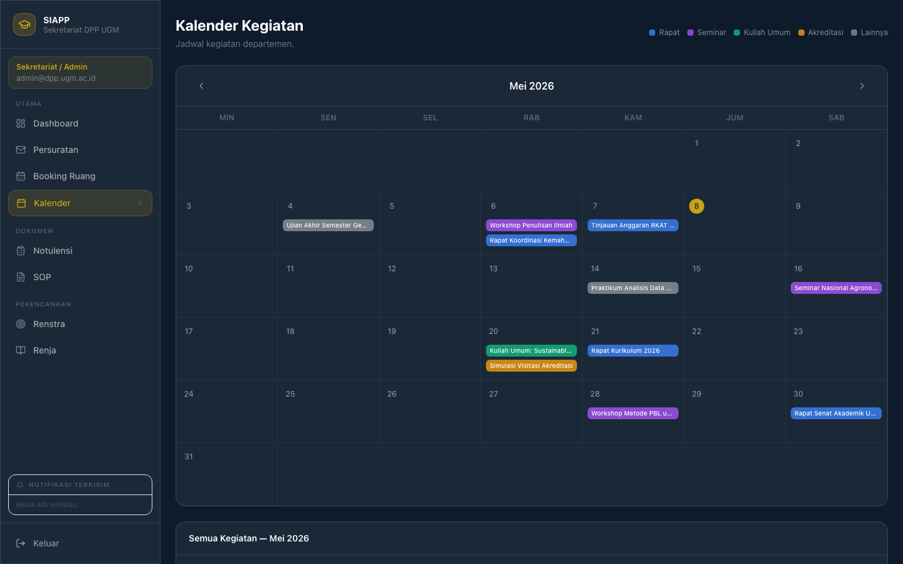

### 5.2 Melihat Detail Kegiatan

Klik salah satu kegiatan pada kalender untuk membuka jendela detail yang berisi:
- Jenis kegiatan
- Judul
- Tanggal dan waktu lengkap
- Lokasi
- Penyelenggara
- Deskripsi (jika ada)

### 5.3 Daftar Kegiatan Bulanan

Di bawah kalender, terdapat daftar kronologis seluruh kegiatan dalam bulan yang sedang ditampilkan, lengkap dengan waktu dan lokasi.

---

## 6. Modul Notulensi

Untuk membuka modul ini, klik **Notulensi** pada menu samping kiri.

### 6.1 Mencari dan Menyaring Notulensi

- **Kotak pencarian** — cari berdasarkan judul, nama pimpinan rapat, atau tempat.
- **Tab label** — saring berdasarkan jenis rapat: Semua / Departemen / Prodi / General / Lainnya.
- **Tab akses** — saring berdasarkan tingkat akses: Semua / Anggota saja / Publik.

### 6.2 Membaca Notulensi

Setiap kartu notulensi menampilkan:
- Judul rapat
- Status (Draft atau Disetujui)
- Tanggal dan tempat
- Jumlah peserta
- Poin agenda

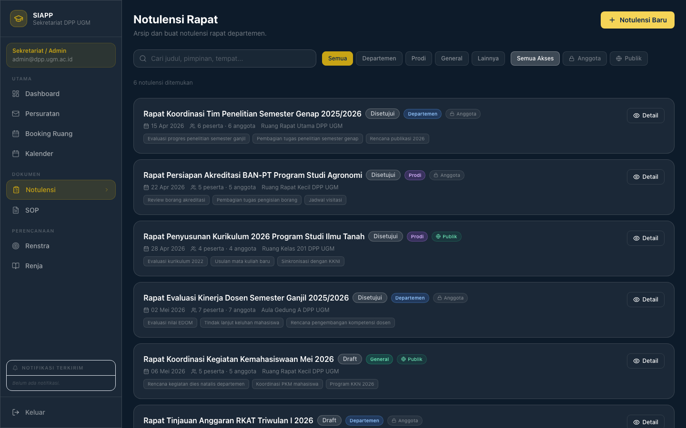

Klik tombol **Lihat Detail** untuk membuka isi lengkap notulensi, yang mencakup:
- Daftar peserta rapat
- Hak akses dokumen
- Agenda rapat (bernomor)
- Keputusan yang diambil
- Tindak lanjut beserta penanggung jawab dan tenggat waktu

> 📸 *[Screenshot belum tersedia: Modal detail notulensi — bagian peserta, agenda bernomor, keputusan, dan tabel tindak lanjut dengan kolom penanggung jawab dan tenggat]*

### 6.3 Membuat Notulensi Baru

1. Klik tombol **+ Buat Notulensi** di pojok kanan atas.
2. Anda akan diarahkan ke halaman formulir.
3. Isi seluruh kolom: judul, tanggal, tempat, pimpinan rapat, peserta, agenda, keputusan, dan tindak lanjut.
4. Pilih **label** dan **tingkat akses** (Anggota atau Publik).
5. Klik **Simpan sebagai Draft** atau **Ajukan untuk Disetujui**.

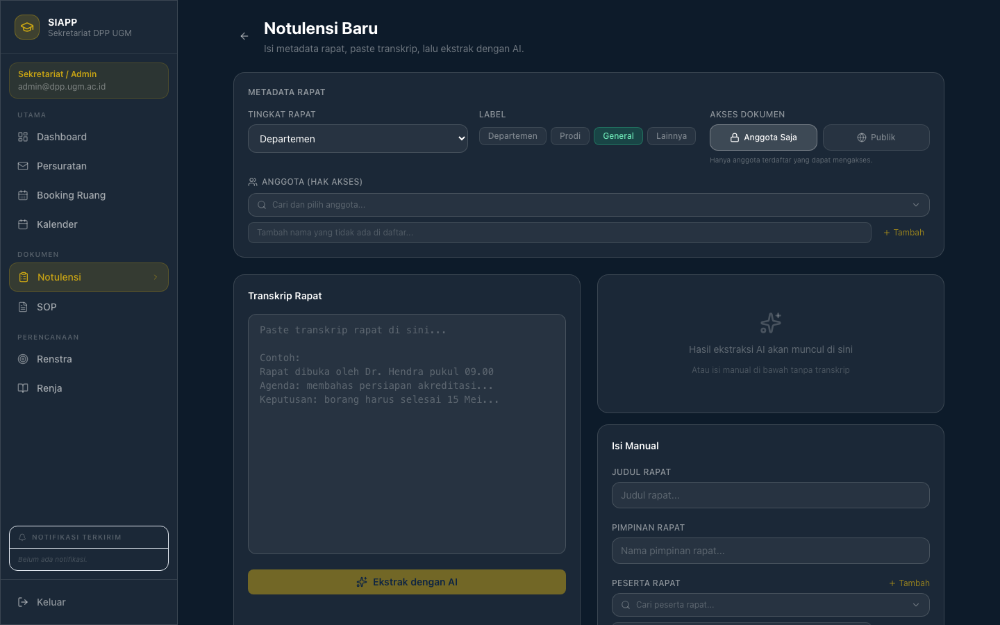

---

## 7. Modul Renja (Rencana Kerja)

Untuk membuka modul ini, klik **Renja** pada menu samping kiri.

Halaman ini menampilkan **Rencana Kegiatan dan Anggaran Tahunan (RKAT)** departemen dalam bentuk yang mudah dibaca.

### 7.1 Panel Ringkasan Anggaran

- **Total RKAT** — total anggaran yang direncanakan tahun ini
- **Realisasi** — jumlah yang sudah terealisasi
- **Serapan (%)** — persentase penyerapan, dengan warna:
  - Hijau (≥ 70%) — baik
  - Kuning (40–69%) — perlu perhatian
  - Oranye (< 40%) — kritis

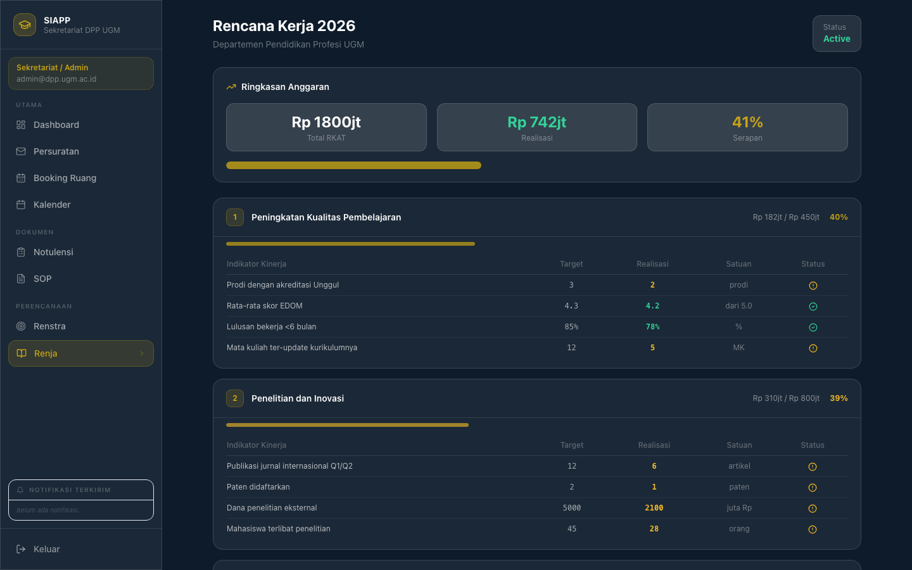

### 7.2 Kartu Program

Setiap program ditampilkan dalam kartu terpisah yang berisi:
- Nama program
- Anggaran dan realisasi dengan bilah kemajuan
- Tabel indikator kinerja: nama indikator, target, realisasi, satuan, dan status (✓ atau ⚠)

---

## 8. Modul Renstra (Rencana Strategis)

Untuk membuka modul ini, klik **Renstra** pada menu samping kiri.

Halaman ini menampilkan dokumen **Rencana Strategis** departemen.

### 8.1 Panel Visi

Menampilkan pernyataan visi departemen.

### 8.2 Panel Misi

Menampilkan daftar misi departemen secara bernomor.

### 8.3 Kartu Tujuan Strategis

Setiap tujuan strategis (target 2030) ditampilkan dalam kartu yang berisi:
- Deskripsi tujuan
- Persentase capaian saat ini (dengan warna: hijau ≥ 75%, kuning ≥ 50%, oranye < 50%)
- Bilah kemajuan
- Chip indikator keberhasilan

---

## 9. Modul SOP

Untuk membuka modul ini, klik **SOP** pada menu samping kiri.

### 9.1 Mencari SOP

- Gunakan **kotak pencarian** untuk mencari berdasarkan judul, ringkasan, atau nomor SOP.
- Gunakan **tombol kategori** untuk menyaring berdasarkan jenis prosedur.
- Sistem menampilkan hitungan: "Menampilkan X dari Y SOP aktif".

### 9.2 Membaca SOP

Setiap SOP ditampilkan dalam kartu yang dapat diperluas. Klik kartu untuk melihat:
- Nomor SOP dan versi
- Tanggal berlaku (Efektif)
- Unit penanggung jawab
- Ringkasan prosedur
- Langkah-langkah pelaksanaan (bernomor)

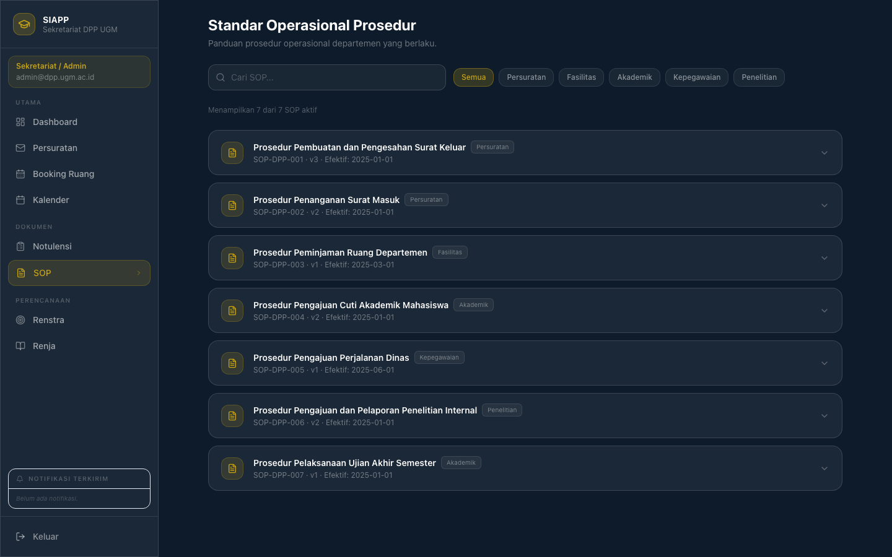

---

## 10. Keluar dari Sistem

1. Klik nama atau foto profil Anda di pojok kanan atas layar.
2. Klik **Keluar** (Logout).
3. Anda akan diarahkan kembali ke halaman login.

> **Tips keamanan:** Selalu keluar dari sistem setelah selesai menggunakannya, terutama jika menggunakan komputer bersama.

---

*Versi dokumen: 1.0 — Mei 2026*
*Untuk pertanyaan teknis, hubungi tim Pijar Foundation.*
